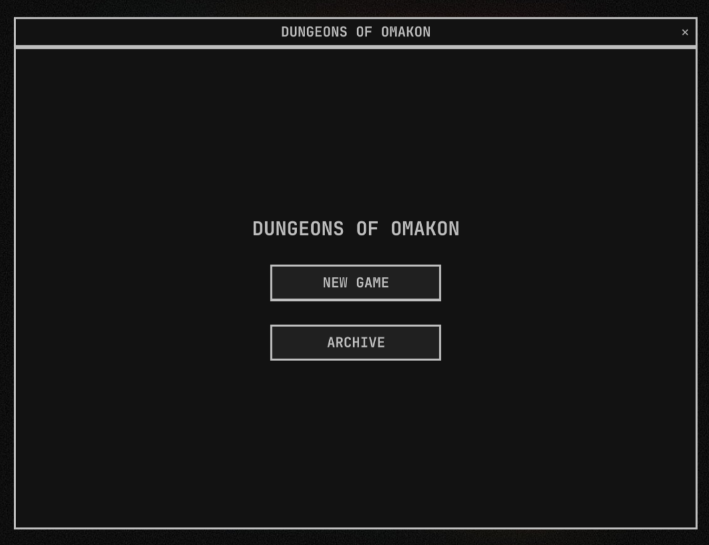
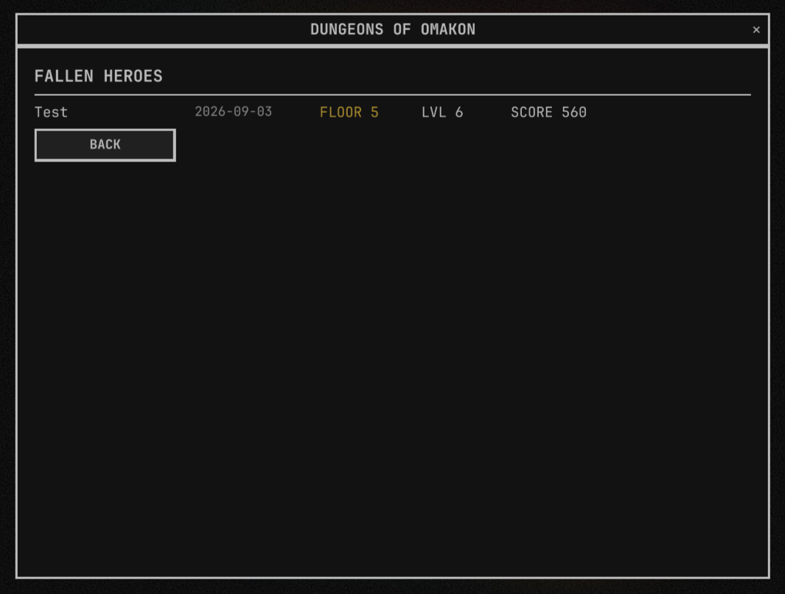
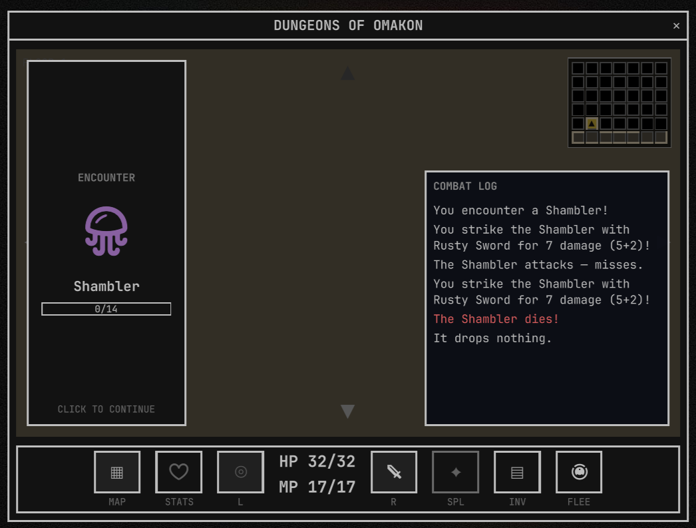
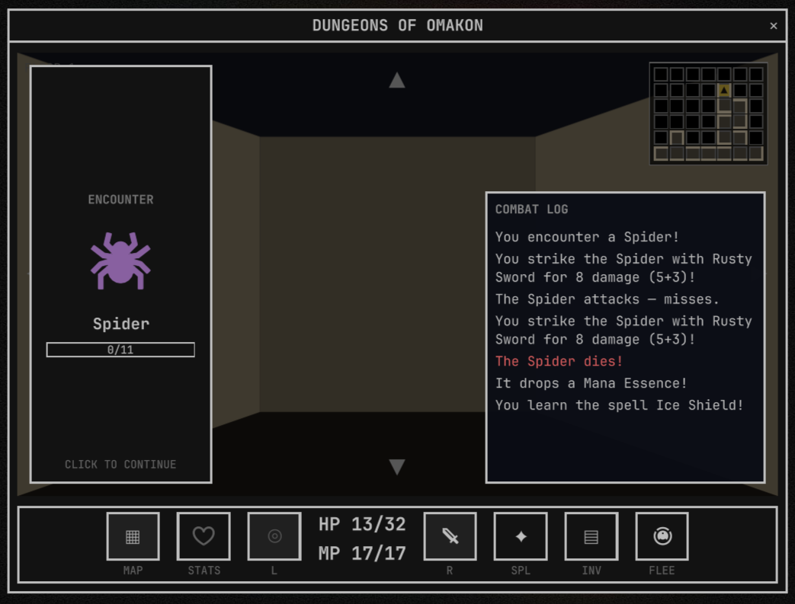
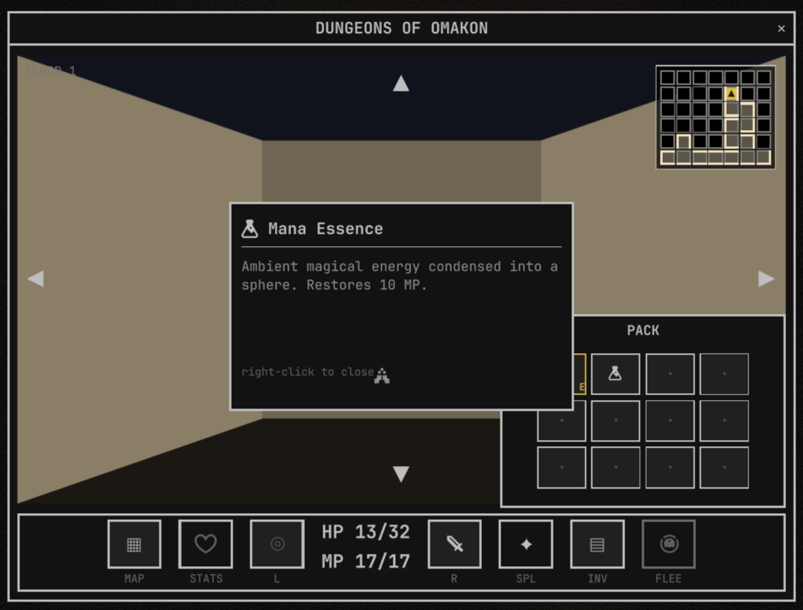
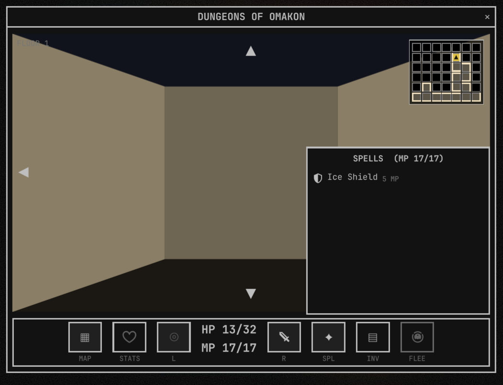

# Dungeons of Omakon

A first-person, 16-bit dungeon crawler that lives in your bar. Click the
sword pill (or hit the hotkey) to open the game window, delve a randomly
generated 6x7 floor, fight monsters, loot, and descend. Permadeath; a
rolling archive of your last 10 characters records their deepest floor and
score.



| | |
| --- | --- |
|  |  |
|  |  |
|  | |

Dungeons of Omakon is an [Omarchy](https://omarchy.org) shell plugin — a
Quickshell bar widget + exclusive-focus game window. All game logic
(dungeon gen, combat, spells, drops, poison, enchanting) lives in pure,
Node-testable JavaScript modules with a full test suite; the QML layer is
rendering and input only.

- Procedurally generated 6x7 perfect-maze floors, 50 levels deep
- Turn-based combat: accuracy vs. defense, STR/DEX/CON/INT/WIL builds
- 60 hand-authored monsters, 104 equipment rows, 20 spells
- Enchanting, poison, fleeing, beacons, and a floor-50 Omatrix endgame
- Persistent runs via the system keyring — pick up mid-run any time

## Install

```sh
omarchy plugin add https://github.com/Signal-Six/Dungeons-Of-Omakon.git --enable
```

This clones the plugin into `~/.config/omarchy/plugins/`, validates the
manifest, and enables it. Click the † pill in the bar to play, or toggle
it with:

```sh
omarchy-shell shell toggle b.omakon
```

To update to the latest version:

```sh
omarchy plugin update
```

Requirements: `secret-tool` (libsecret) with an unlocked keyring for run
persistence, and JetBrainsMono Nerd Font (Omarchy default) for the icon
glyphs.

## Windows (standalone app)

No Omarchy needed — the game also ships as a plain desktop app for Windows.
Grab the latest `omakon-windows-*.zip` from the
[Releases](https://github.com/Signal-Six/Dungeons-Of-Omakon/releases) page,
extract it, and run `omakon.exe`. No install; the folder is self-contained
(Qt runtime bundled). Delete the folder to uninstall.

Saves live at `%APPDATA%\SignalSix\omakon\run.json` — runs persist between
sessions just like the plugin version.

The Nerd Font the icons use is bundled inside `omakon.exe`, so no extra
install is needed — icons render identically on a fresh machine.

Controls: click the on-screen arrows, or use Arrow keys / WASD
(Up/W forward, Down/S back, Left/A and Right/D turn).

## Development

Dev-install by symlink instead of clone:

```sh
ln -snf "$PWD" ~/.config/omarchy/plugins/b.omakon
omarchy-shell shell rescanPlugins
omarchy plugin enable b.omakon
omarchy plugin validate b.omakon
```

## License

MIT. See [LICENSE](LICENSE).
